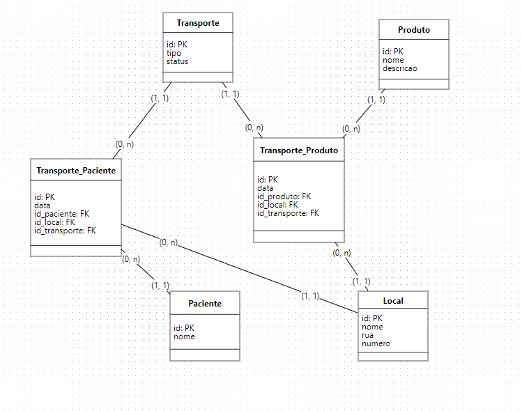
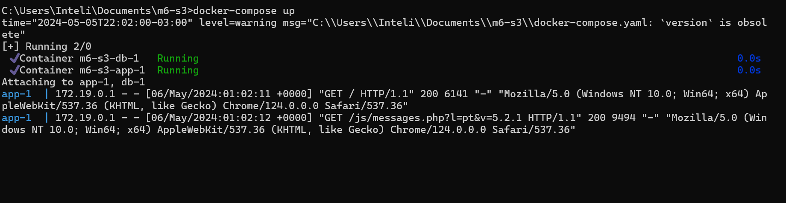
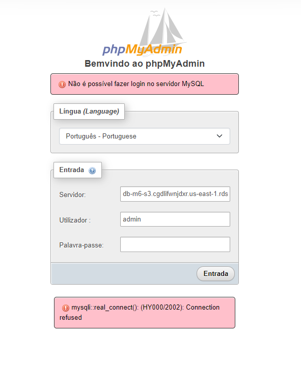
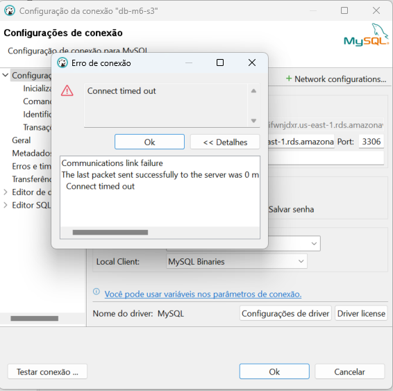
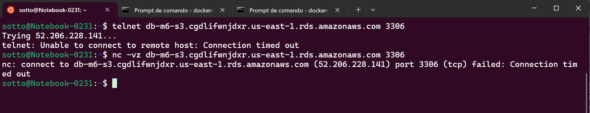

# m6-s3

Este README contém o modelo lógico de um banco de dados destinado a explicar o armazenamento de dados sobre o transporte de pacientes e produtos médicos. O banco de dados está hospedado na Amazon RDS, utilizando o MySQL.

## Diagrama do Modelo Lógico

Abaixo está o diagrama do modelo lógico do banco de dados:

<h6 align="center"> Figura 1: Modelo Lógico</h6>

<div style="text-align: center;">
  
</div>

Este diagrama foi criado utilizando a ferramenta web BRModelo, e ilustra as tabelas, suas relações, chaves primárias, chaves estrangeiras e outros atributos relevantes.

## Configuração do Ambiente

### Conexão com o Banco de Dados

Não consegui conectar com o banco de dados. Tentei conectar no phpMyAdmin utilizando o docker-compose do professor Romualdo:

<h6 align="center"> Figura 2: Docker compose rodando</h6>

<div style="text-align: center;">
  
</div>

<h6 align="center"> Figura 3: Erro com phpMyAdmin</h6>

<div style="text-align: center;">
  
</div>

tentei também no dbeaver:

<h6 align="center"> Figura 4: Erro com DBeaver</h6>

<div style="text-align: center;">
  
</div>

por fim, testei uma conexão dierta usando o comando telnet:

<h6 align="center"> Figura 5: Erro com telnet</h6>

<div style="text-align: center;">
  
</div>

Habilitei todas as portas e IP's a acesrem o RDS mas ainda não consegui.

## Realizando Queries no Banco de Dados

&emsp;&emsp;Ainda que não consegui conectar, a query para calcular o número médio de pacientes transportados por veículo por mês seria:

```
SELECT
    YEAR(data) AS Ano,
    MONTH(data) AS Mes,
    COUNT(DISTINCT id_paciente) / COUNT(DISTINCT id_transporte) AS Media_Pacientes_Por_Veiculo
FROM
    Transporte_Pacientes
GROUP BY
    YEAR(data),
    MONTH(data);

```

- YEAR(data) e MONTH(data): Selecionam o ano e o mês do campo data para agrupar os resultados.
- COUNT(DISTINCT id_paciente) / COUNT(DISTINCT id_transporte): Calcula a média de pacientes distintos transportados por veículo, dividindo o número total de pacientes únicos pelo número total de transportes únicos no mesmo mês e ano.
- FROM Transporte_Pacientes: Indica que os dados são retirados da tabela Transporte_Pacientes.
- GROUP BY YEAR(data), MONTH(data): Agrupa os resultados por ano e mês para calcular a média para cada combinação de mês e ano, permitindo uma análise mensal da eficiência do transporte.
